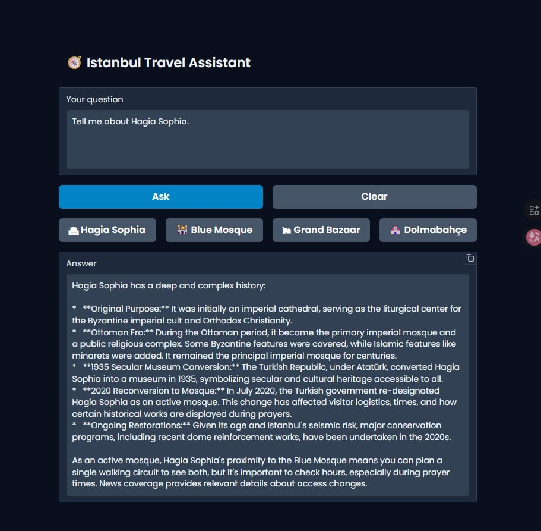

# 🧭 Istanbul Travel Assistant
### 🇹🇷 AI-Powered RAG Chatbot for Tourists Visiting Istanbul  

[]()
[]()
[]()
[]()

---


---

## 🌍 Overview

**Istanbul Travel Assistant** is an intelligent AI chatbot designed to assist tourists visiting Istanbul.  
It combines the power of **Retrieval-Augmented Generation (RAG)** with **Gemini (Google Generative AI)** to deliver **accurate, context-aware, and friendly travel guidance**.  

Unlike a regular chatbot, it doesn’t “guess” — it finds real information from a trusted Istanbul guide text stored on **Hugging Face**, retrieves the most relevant pieces via **ChromaDB**, and then generates answers using **Gemini**.

---

## 🧠 Features

- 💬 **Conversational Chatting** — Natural English dialogue with tourists  
- 🏛 **Factual RAG Answers** — Pulls real data about landmarks like Hagia Sophia, Blue Mosque, Dolmabahçe Palace, etc.  
- 🌈 **Custom UI Theme** — Beautiful blue-white-red palette inspired by Turkish *çini* art  
- 📚 **Local Dataset** — Uses a `.txt` travel guide dataset from Hugging Face  
- ⚙️ **Persistent Chroma Vector Store** — Keeps your embeddings locally  
- 🪶 **Gradio Frontend** — Ready-to-share interactive web UI  

---

## 🧩 Project Structure
rag_chatbot/
│
├── scripts/
│ ├── chatbot.py # Main app with Gradio UI + Gemini integration
│ └── reindex_persist.py # Embeds and stores dataset in ChromaDB
│
├── assets/
│ └── cini.jpg # Turkish ceramic (çini) background image // not applied yet
│
├── .env # Environment variables template
├── requirements.txt # Required packages and versions
└── README.md # This documentation file


---

## ⚙️ Installation & Setup

### 1️⃣ Clone the repository
```bash
git clone https://github.com/zehrayldz00/akbankgenai-ragchatbot.git
cd rag_chatbot

```

### 2️⃣ Create and activate a virtual environment
```bash
python -m venv venv
venv\Scripts\activate      # Windows
# source venv/bin/activate # macOS / Linux

```

### 3️⃣ Install dependencies
```bash
pip install -r requirements.txt


🔐 Environment Variables

Rename .env.example → .env and fill in your own keys:

GEMINI_API_KEY=YOUR_GEMINI_API_KEY
HUGGINGFACE_DATASET=zehrayldz00/istanbulguide
COLLECTION_NAME=istanbulguide_collection
CHROMA_PERSIST_DIR=./chroma_persist
EMBED_MODEL_NAME=sentence-transformers/paraphrase-multilingual-mpnet-base-v2


🧩 Important:
Do not upload your .env file to GitHub — it contains your private API key.
The repo already includes .gitignore to protect it.


📚 Dataset: Istanbul Knowledge Pack (LLM-Assisted)

This project uses a custom Istanbul knowledge dataset generated with the help of a Large Language Model (LLM) to provide rich, accurate, and diverse contextual information about Istanbul.

Data Generation:
The dataset was created by prompting an LLM with topic-specific instructions to produce high-quality content about Istanbul’s history, architecture, culture, local tips, and travel logistics (e.g., transportation, visiting hours, ticket information, nearby attractions).

Curation & Refinement:
Generated content was manually reviewed and cleaned — repetitive or conflicting information was removed, text was normalized for consistent formatting, and factual accuracy was prioritized.
Unverified or fictional claims were excluded to maintain encyclopedic reliability.

Structure & Format:
The dataset is stored as plain text, optimized for Retrieval-Augmented Generation (RAG) workflows.
Each passage is semantically chunked and indexed into ChromaDB for fast retrieval.

Multilingual Compatibility:
Since the embedding model sentence-transformers/paraphrase-multilingual-mpnet-base-v2 is multilingual, the system can effectively handle both English and Turkish user queries.

Hosting:
The dataset is hosted on Hugging Face Datasets under the repository:
zehrayldz00/istanbulguide

It is automatically fetched during the indexing process in this project.

⚙️ The dataset provides factual, structured knowledge while avoiding model hallucination.
When uncertain, the chatbot defaults to saying “I don’t have that information in the guide,” ensuring safety and reliability.


🧮 Step 1 — Create Chroma Index

This script downloads the text dataset from Hugging Face, splits it into small chunks, and stores their embeddings locally.

python scripts/reindex_persist.py


When finished, you should see:
>> Done. Added chunks: XXXX
>> Now run: python chatbot.py

💬 Step 2 — Run the Chatbot
python scripts/chatbot.py


You’ll see something like:

Running on local URL:  http://127.0.0.1:7860
Running on public URL: https://xxxxx.gradio.live


Click the public URL to open your live chatbot interface.

✨ Usage Examples
Hi!	Casual chat mode
Who built the Hagia Sophia?	RAG factual answer
Tell me about the Blue Mosque.	Context-based description
What is the Grand Bazaar known for?	Historical & cultural info
Tell me about Dolmabahçe Palace.	Informative guide answer

💡 RAG Architecture Explained
User Question
   ↓
SentenceTransformer → Converts question into embedding
   ↓
ChromaDB → Finds the most similar text chunks
   ↓
Gemini → Generates an answer using those chunks as context
   ↓
Gradio → Displays it beautifully in the web app


Result:
✅ Accurate
✅ Context-aware
✅ No hallucinations


📘 Core Files Explained
🔹 reindex_persist.py

Downloads .txt from Hugging Face.

Splits it into overlapping chunks (≈1000 chars each).

Generates vector embeddings.

Stores everything into ChromaDB (./chroma_persist/).


🔹 chatbot.py

Loads embeddings and Gemini model.

Detects intent: chat (greeting) or rag (information).

Retrieves top-K chunks for the query.

Builds prompt with context.

Calls Gemini API → returns formatted answer.

Displays Gradio UI (with themed design & ready buttons).


🧱 Technical Stack
Component	--->  Technology
Embedding  ---> 	sentence-transformers/paraphrase-multilingual-mpnet-base-v2
Vector DB  ---> 	ChromaDB
LLM	 ---> Gemini 2.5 Flash
UI	---> Gradio
Hosting	--->  Gradio share=True (public temporary link)
Dataset ---> 	zehrayldz00/istanbulguide on Hugging Face





